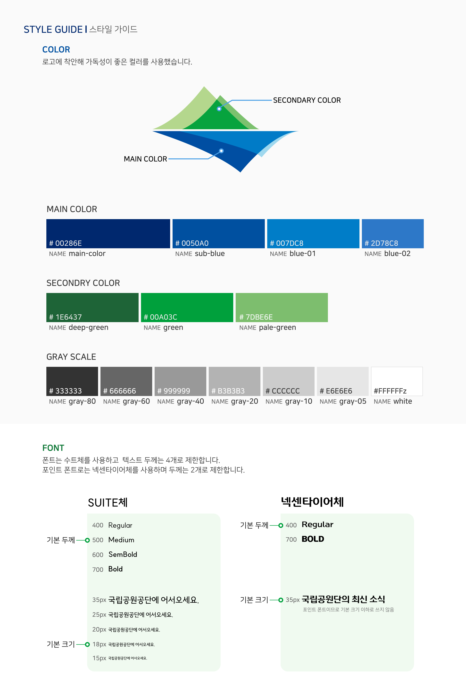

# 🌲국립공원 리뉴얼🌲
> **일관성 있는 UI와 정리된 디자인 환경에서의 사용을 위해 전반적인 리뉴얼을 진행하였습니다😊**  
> **홈페이지💻 https://cookieo3o.github.io/national-park/**
 
 

| Before | Renewal |
|--------|-------|
| |  |

 

| Style Guide |
|--------|
|  |
 
 

## 작업 환경
     
   
 
 

## 프로젝트 개요
본 프로젝트는 기존 웹사이트의 정보 구조와 사용성 문제를 분석하고, 이를 개선하기 위한 UX/UI 리디자인을 목표로 한다. 
현재 사이트는 콘텐츠는 풍부하지만 정보의 위계와 구분이 명확하지 않아 가독성과 탐색 효율이 떨어지며, 중요한 정보를 놓치기 쉬운 구조를 가지고 있다.
 
 

## 리뉴얼 방향
본 프로젝트의 리뉴얼은 사용자 경험 개선과 브랜드 아이덴티티 강화를 핵심 방향으로 진행되었다. 
정보 구조, 디자인 시스템, 콘텐츠 가시성을 전반적으로 재정비하여 일관되고 직관적인 웹 경험을 제공하는 것을 목표로 한다. 

### 1. 브랜드 이미지 강화
- 브랜드 성격을 명확히 드러내는 비주얼 아이덴티티 재정립
- 컬러, 타이포그래피, 레이아웃의 통일성을 통해 신뢰도와 전문성 강화

 ### 2. 통일화된 디자인
- 페이지 및 섹션 간 디자인 일관성 확보
- 반복 요소에 디자인 시스템을 적용하여 안정적인 사용자 경험 제공

### 3. 주요 콘텐츠 가시성 강화
- 핵심 콘텐츠 중심의 정보 재배치
- 정보 위계 구조 개선을 통해 중요한 내용을 빠르게 인지할 수 있도록 설계

### 4. 사용자 친화성 강화
- 직관적인 UI 구성과 인터랙션 개선
- 사용자 행동 흐름을 고려한 레이아웃으로 탐색 효율 향상
 

## 주요 기능
### Layout & Typography

| 구분 | 항목 | 내용 |
|----|----|----|
| 폰트 | 전체 사이트 | 한글 · 영문 SUITE체 사용 |
| 레이아웃 | 전체 | Width 100% |
| 레이아웃 | Inner | Max-width 1200px 

### Navigation (Header)

| 구분 | 요소 | 클래스 / 구조 | 기능 설명 |
|----|----|----|----|
| Header | 로고 | `.header .inner logo > a > img` | 클릭 시 메인 페이지로 이동 |
| Navigation | 메뉴 | `.nav > ul > li > a` | 마우스 호버 시 서브 메뉴 노출 |
| Navigation | 언어 선택 | `.language > a` | 언어 변경 기능 제공 |

**동작 정의**
1. 각 메뉴에 마우스 호버 시 서브 네비게이션이 펼쳐짐  
2. 메뉴 클릭 시 해당 페이지로 이동  

### Main Visual Section

| 구분 | 요소 | 클래스 | 기능 설명 |
|----|----|----|----|
| Section | 메인 비주얼 | `section#main-visual` | 메인 화면 영역 |
| Layout | 내부 영역 | `.inner` | 콘텐츠 중앙 정렬 |
| Title | 타이틀 | `.title` | 메인 메시지 노출 |
| Text | 설명 | `.main-explan` | 메인 비주얼 설명 텍스트 |
| Map | 콘텐츠 | `.main-map` | 클릭 가능한 메인 콘텐츠 영역 |

**동작 정의**
1. 탭 클릭 시 배경 이미지와 좌측 설명 영역 변경  
2. 메인 콘텐츠 클릭 시 해당 상세 페이지로 이동  
3. 버튼 호버 시 위치 표시 및 강조 효과 적용

### Quick Menu

| 구분 | 요소 | 클래스 / 구조 | 기능 설명 |
|----|----|----|----|
| Quick Menu | 메뉴 영역 | `section#quick-menu` | 주요 서비스 바로가기 제공 |
| Quick Menu | 아이콘 | `.icon-wrap a` | 서비스별 페이지 이동 |
| Quick Menu | 텍스트 | `.icon-wrap p` | 아이콘 설명 텍스트 |

**동작 정의**
1. 아이콘 호버 시 글자 및 포인트 색상 변경  
2. 이미지가 위쪽으로 이동하며 강조 효과 적용  

### Notice Banner

| 구분 | 요소 | 클래스 / 구조 | 기능 설명 |
|----|----|----|----|
| Notice Banner | 배너 영역 | `section#notice-banner` | 주요 공지 콘텐츠 노출 |
| Notice Banner | 배너 카드 | `.banner-card` | 공지 카드 표시 |
| Notice Banner | 버튼 | `.banner-card button` | 상세 페이지 이동 |

**동작 정의**
1. 카드 호버 시 이미지가 위 → 아래로 이동  
2. 중앙 버튼 활성화  
3. 스크롤 시 배너 영역이 위 → 아래로 등장  

### News (최신 소식)

| 구분 | 요소 | 클래스 / 구조 | 기능 설명 |
|----|----|----|----|
| News | 뉴스 영역 | `section#news` | 최신 소식 제공 |
| News | 탭 메뉴 | `.news-tab-wrap button` | 카테고리별 뉴스 전환 |
| News | 뉴스 카드 | `.news-list li` | 뉴스 요약 정보 |
| News | 더보기 버튼 | `.plus-btn` | 뉴스 목록 확장 |

**동작 정의**
1. 탭 호버 시 색상 변경, 클릭 시 콘텐츠 변경  
2. 카드 호버 시 이미지 좌 → 우 이동  
3. 카드에 `box-shadow` 강조 효과  
4. 클릭 시 상세 페이지 이동  
5. 스크롤 시 요소들이 시간차를 두고 아래로 등장  

### Gallery

| 구분 | 요소 | 클래스 / 구조 | 기능 설명 |
|----|----|----|----|
| Gallery | 갤러리 영역 | `section#gallery` | 이미지 갤러리 제공 |
| Gallery | 탭 메뉴 | `.left-menu` | 카테고리 선택 |
| Gallery | 슬라이더 | `.gallery-slider` | 이미지 슬라이드 |
| Gallery | 컨트롤 | `.slider-control` | 슬라이드 이동 |
| Gallery | TOP 버튼 | `.top-btn` | 상단 이동 |

**동작 정의**
1. 탭 클릭 시 배경 변경 및 화살표 등장  
2. 이미지 호버 시 `box-shadow` 적용  
3. 이미지 클릭 시 상세 페이지 이동  
4. 컨트롤로 슬라이드 이동  
5. TOP 버튼 클릭 시 상단 이동  
6. 스크롤 시 좌측 메뉴와 슬라이더가 서로 다른 방향으로 등장  

### Footer

| 구분 | 요소 | 클래스 / 구조 | 기능 설명 |
|----|----|----|----|
| Footer | 푸터 영역 | `footer` | 사이트 하단 정보 |
| Footer | 로고 | `.footer-logo a img` | 메인 페이지 이동 |
| Footer | 메뉴 | `.footer-menu a` | 페이지 이동 |
| Footer | SNS 아이콘 | `.sns-icon-wrap a img` | SNS 페이지 이동 |

**동작 정의**
1. 로고 클릭 시 메인 페이지 이동  
2. 메뉴 클릭 시 해당 페이지 이동  
3. SNS 아이콘 클릭 시 외부 페이지 이동  
 
 
